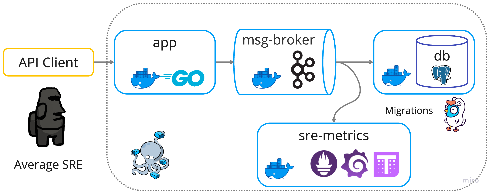

> [!NOTE]
> Here are our labs from ITMO Third semester

# Discipline
Technologies and Infrastructure for Big Data

## Instructors
[Nikolay Butakov](https://en.itmo.ru/en/viewperson/1257/Nikolay_Butakov.htm)

Performed by
* Me and
* [Michael Grigoriev @Dormant512](https://github.com/Dormant512)
* [Michael Lovtskiy @MichaelKae](https://github.com/MichaelKae)
* [Valeria Semenova @SemenovaValeria](https://github.com/SemenovaValeria)

## Logs, metrics and business processes.
> [!NOTE]
> Imagine we have a web platform for online sales. Users may visit and view different pages on the platform’s website and perform various operations, mainly: reserving, buying, refunding, canceling reservations. The platform is implemented as a fleet of micro services and to perform financial transactions may communicate with external services (thus they are out of our control) depending on the user’s prefered way and provider to make payment. Multiple micro-services participate in processing every operation thus it is guaranteed that each has a unique ID associated with it, staying preserved across all microservices. Users may make mistakes when they reserve or buy, external services may be temporarily unavailable or overloaded to process payment requests. The platform’s software and the external services also may contain bugs that lead to various errors.
   This fleet constantly  generates logs, metrics and database records. The business wants these logs and metrics to be collected to calculate various statistics and to check for performance problems, errors and anomalies. You need to build a system that may serve analytical queries, raise alerts when anomalies are detected and fill dashboards dedicated for monitoring (not realtime, but close to it).
   Incoming data of the last month should be stored in a “hot” storage for fast operative access while older data should be moved to the archive on S3. Alerts should be raised either instantly or in a matter of a few minutes if the event is complex (for example, multiple unsuccessful retries for several users with the same payment provider).
   To make your task a little less difficult, there already exists an infrastructure for data collecting from above-mentioned sources that writes collected data into a message queue system. Thus you only need to integrate with this MQ, not with the whole fleet.
   Examples of possible user queries that needs to be satisfied:
> 1. 	Get all events across different microservices related to the same action ID (e.g. request tracing).
> 2. 	Get events by specific event level (debug/info/warn/error) and their type of one or more microservices for a specific interval.
> 3. 	Number of simultaneous users viewing / buying
> 4. 	Business metrics (for financial reporting and anomalies detecting to raise alarms):
>    - transactions count per interval (15 minutes / 1 hour / 3 hour / 1 day)
>    - page views per interval (15 minutes / 1 hour / 3 hour / 1 day)
>    - retries with successful or unsuccessful outcomes (eventual ones)
> 5. Performance:
>    - operation execution time (min, max, average, percentiles);
>    - CPU / RAM consumption per interval simultaneously with number of users
> 6. Anomalies:
>    - multitude of same operations;
>    - buying and refunding, etc.

> [!IMPORTANT]
> System requirements:
> 1. Sharding (at least 3 servers).
> 2. Replication.
> 3. Reading from a message queue system (Kafka, Redis).
> 4. Incoming data should be processed with a streaming solution (Spark Streaming, but an alternative may be proposed) to raise alarms if anomalies are found (applicable only for small periods of time: tens of seconds or few minutes).
> 5. Archiving is a must.
> 6. At least one dashboard is a must.
> 7. Data generator(-s) and ingestion procedure is a must (note: one can use libraries to fake logs, for instance https://github.com/mingrammer/flog).
> 8. Generators of request workload should be implemented. The storage should be able to insert and process select queries simultaneously.
> 9. Test scenarios should be implemented as a demo of the solution.
> 10.  Bare-metal deployment is forbidden. Deploy the storage with replicas, queues, generators, requesters and other modules using Kubernetes, docker (see: Kubernetes’ StatefulSet / Deployment / Job, etc.)  

## Architecture
> [!WARNING]
>
> 
> 
